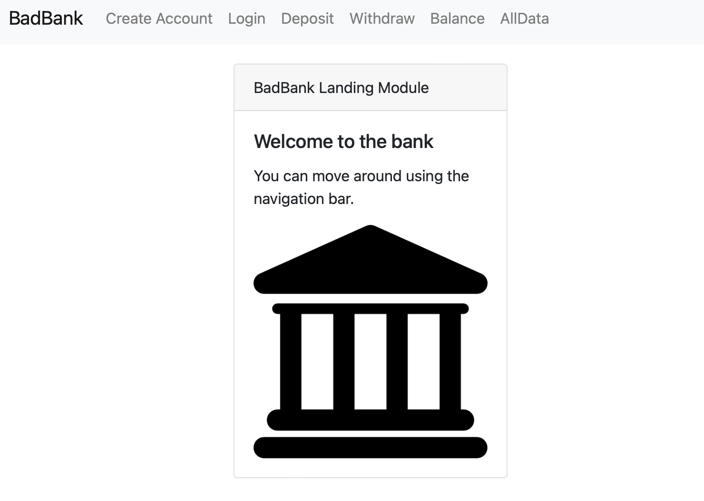
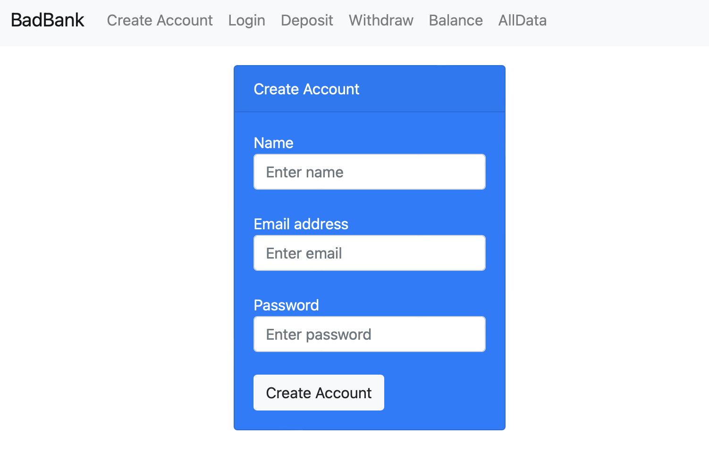
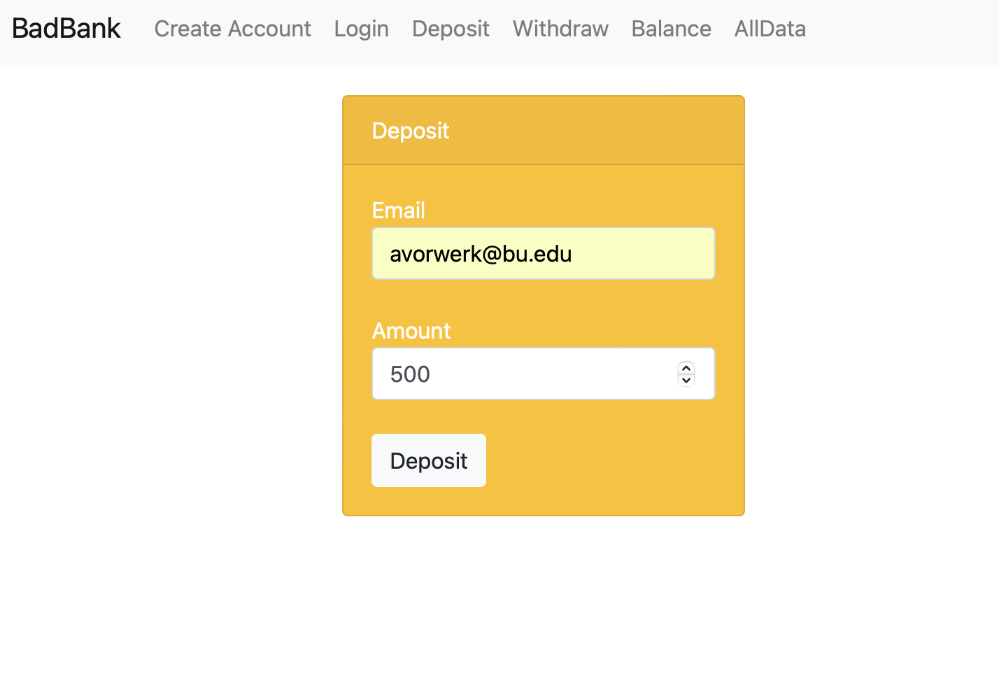
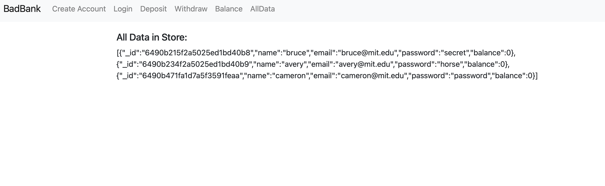

<h1>Project Title: Bad Bank</h1>
<h2>Description:</h2>
This project is part of the MIT xPro full stack development course. Given starter code, we built a three tier banking application that runs on your local server. It allows users to create an account, login, deposit and withdraw funds and check their balance, and view all data of all existing accounts.
<h2>Installation Guidelines:</h2> 
Clone this repo using git clone or download it to your local machine. Open the folder and run npm init to install the packages locally. Run the program using localhost on your browser.

<h2>Preview:</h2> </></></></>
<h2>Technology used:</h2> <ul><li>JavaScript</li><li>React</li><li>Bootstrap</li><li>Express</li><li>Node</li><li>MondoDB</li><li>Docker</li></ul>
<h2>Features:</h2> 
Going forward I will add authentification and authorization so that a user can only view their on personal information. The goal is to make this a "good" bank where all data is secure.

<h2>License:</h2> 
MIT

